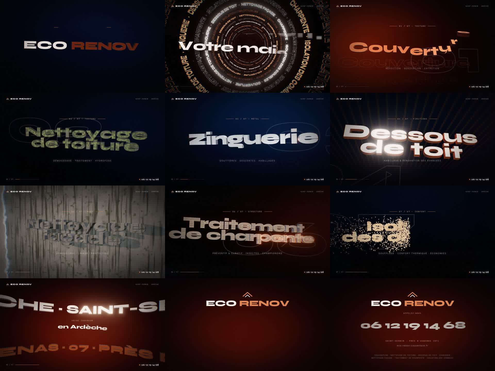

# Eco Renov — film de présentation (51 s, 1920×1080, 30 i/s)

Film motion-design 3D pour **Eco Renov** — couvreur à Saint-Sernin, près d'Aubenas (07) — 06 12 19 14 68.

`eco-renov-film.mp4` : le film final (H.264 6 Mb/s + AAC 192 kb/s, bande-son originale incluse, 39 Mo).


## Découpage

| # | Temps | Scène | Rendu 3D / transition |
|---|-------|-------|-----------------------|
| — | 0:00 | Intro « ECO RENOV » | Tracé lumineux de la maison, murs qui s'élèvent, ~500 tuiles canal qui volent se poser sur le toit |
| 01 | 0:06 | Couverture | Champ de tuiles en suspension qui s'abattent en vague, lumière rasante de fin de journée — *zoom punch* |
| 02 | 0:11 | Nettoyage de toiture | Toiture couverte de mousse, front de lavage haute pression avec gerbe d'eau — *lame diagonale* |
| 03 | 0:16 | Zinguerie | Gouttières en zinc et cuivre qui se déploient en rubans, plaques à joint debout en apesanteur — *tuiles qui pivotent* |
| 04 | 0:21 | Dessous de toit | Lames de sous-face qui basculent une à une sous l'avant-toit — *lames horizontales* |
| 05 | 0:26 | Nettoyage façade | Mur de panneaux encrassés qui se retournent en vague pour révéler le crépi propre — *dissolution cuivrée* |
| 06 | 0:31 | Traitement de charpente | Plan filaire → fermes en bois qui s'assemblent → scan de traitement — *zoom punch* |
| 07 | 0:36 | Isolation des combles | Soufflage de milliers de fibres, la chaleur reste dans la maison — *lame diagonale* |
| — | 0:41 | Final | Maison terminée au coucher du soleil, logo, prestations, téléphone, site — *dissolution cuivrée* |

## Régénérer la vidéo

```bash
cd src && npm install
python3 -m http.server 8123 &          # sert index.html + main.js
node render.mjs 0 2000                 # -> frames/fXXXXX.jpg (Chromium headless, WebGL)
python3 audio.py                       # -> music.wav (bande-son synthétisée, calée sur les transitions)
ffmpeg -framerate 30 -i frames/f%05d.jpg -i music.wav -c:v libx264 -preset slow -crf 18 \
       -pix_fmt yuv420p -c:a aac -b:a 192k -movflags +faststart -shortest eco-renov-film.mp4
```

Aperçu en temps réel dans un navigateur : `http://localhost:8123/index.html?play`, ou une image précise avec `?t=12.5`.

Les textes (titres, sous-titres, coordonnées) sont dans `src/index.html` et dans l'objet `CARDS` de `src/main.js`.

---

# Version 2 — 100 % typographique (52 s)



`eco-renov-typo.mp4` (40 Mo) : même univers, sans aucune illustration. Uniquement du texte : lettres extrudées en 3D (crème, cuivre, chrome, bois, crépi), mises en lumière et animées.

| Temps | Séquence | Animation |
|-------|----------|-----------|
| 0:00 | ECO RENOV | Les lettres 3D surgissent des profondeurs et se posent, une lame de lumière balaie le logo |
| 0:06 | Votre toit. Votre maison. Notre métier. | Vol à travers un tunnel d'anneaux de texte (les 7 prestations) |
| 0:11 | 01 Couverture | Les lettres tombent et s'emboîtent comme des tuiles |
| 0:15 | 02 Nettoyage de toiture | Lettres couvertes de mousse, lavées par un jet d'eau |
| 0:19 | 03 Zinguerie | Lettres chromées qui pivotent, reflets en mouvement |
| 0:22 | 04 Dessous de toit | Vue en contre-plongée, lettres qui basculent en place comme des lames |
| 0:26 | 05 Nettoyage façade | Lettres qui sortent d'un mur crépi encrassé, puis nettoyage |
| 0:30 | 06 Traitement de charpente | Tracé filaire cuivré → lettres en bois → scan de traitement |
| 0:34 | 07 Isolation des combles | Des milliers de fibres soufflées viennent former les lettres |
| 0:38 | Saint-Sernin · Ardèche | Anneaux de lettres 3D en rotation autour de la caméra |
| 0:43 | Final | Logo, numéro 06 12 19 14 68 qui défile comme une machine à sous, site, prestations |

Régénération : comme la version 1, avec `PAGE=typo.html OUT=frames2 node render.mjs 0 2000`, puis `python3 audio.py typo_audio.json` (→ `music_typo.wav`) et ffmpeg sur `frames2/`.

---

# Version 3 — Publicité portrait 9:16 (29 s, 1080×1920)

`eco-renov-pub-portrait.mp4` : publicité verticale (Reels / TikTok / Stories / Shorts) construite à partir des photos fournies.
Logo et accents dans le vert du site : **#44C867**.

- Photos intégrées en **relief** : fausse carte de profondeur + parallaxe selon la caméra, cartes 3D épaisses (tranche verte), fond flou en profondeur, cadre décalé, numéros 3D.
- Entrée différente pour chaque prestation (flip latéral, montée, chute, tranches, zoom depuis le fond, diagonale), transitions shader entre les scènes.
- Anneau 3D de toutes les photos, puis final avec numéro **06 12 19 14 68** en rouleau de machine à sous et bouton « Contactez-nous ».
- Zones de sécurité des réseaux sociaux respectées (titres entre 1330 et 1650 px, pied de page à 232 px du bas).

Régénération : `PAGE=ad.html VW=1080 VH=1920 OUT=frames3 node render.mjs 0 870`, `python3 audio.py ad_audio.json`, puis ffmpeg comme pour les versions précédentes (les photos sont à placer dans `src/ads/photos/`).
