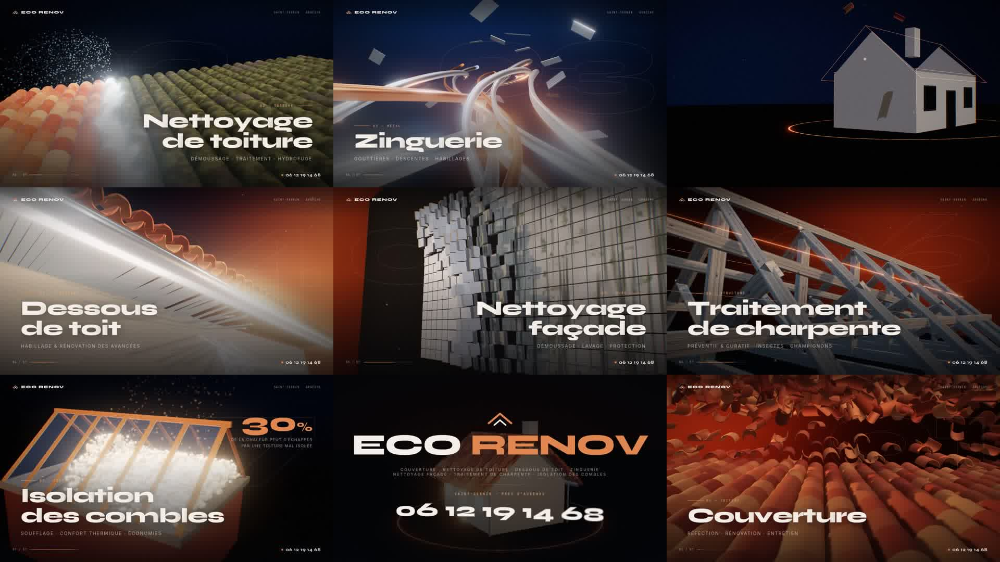

# Eco Renov — film de présentation (51 s, 1920×1080, 30 i/s)

Film motion-design 3D pour **Eco Renov** — couvreur à Saint-Sernin, près d'Aubenas (07) — 06 12 19 14 68.

`eco-renov-film.mp4` : le film final (H.264 6 Mb/s + AAC 192 kb/s, bande-son originale incluse, 39 Mo).



## Découpage

| # | Temps | Scène | Rendu 3D / transition |
|---|-------|-------|-----------------------|
| — | 0:00 | Intro « ECO RENOV » | Tracé lumineux de la maison, murs qui s'élèvent, ~500 tuiles canal qui volent se poser sur le toit |
| 01 | 0:06 | Couverture | Champ de tuiles en suspension qui s'abattent en vague, lumière rasante de fin de journée — *zoom punch* |
| 02 | 0:11 | Nettoyage de toiture | Toiture couverte de mousse, front de lavage haute pression avec gerbe d'eau — *lame diagonale* |
| 03 | 0:16 | Zinguerie | Gouttières en zinc et cuivre qui se déploient en rubans, plaques à joint debout en apesanteur — *tuiles qui pivotent* |
| 04 | 0:21 | Dessous de toit | Lames de sous-face qui basculent une à une sous l'avant-toit — *lames horizontales* |
| 05 | 0:26 | Nettoyage façade | Mur de panneaux encrassés qui se retournent en vague pour révéler le crépi propre — *dissolution cuivrée* |
| 06 | 0:31 | Traitement de charpente | Plan filaire → fermes en bois qui s'assemblent → scan de traitement — *zoom punch* |
| 07 | 0:36 | Isolation des combles | Soufflage de milliers de fibres, la chaleur reste dans la maison — *lame diagonale* |
| — | 0:41 | Final | Maison terminée au coucher du soleil, logo, prestations, téléphone, site — *dissolution cuivrée* |

## Régénérer la vidéo

```bash
cd src && npm install
python3 -m http.server 8123 &          # sert index.html + main.js
node render.mjs 0 2000                 # -> frames/fXXXXX.jpg (Chromium headless, WebGL)
python3 audio.py                       # -> music.wav (bande-son synthétisée, calée sur les transitions)
ffmpeg -framerate 30 -i frames/f%05d.jpg -i music.wav -c:v libx264 -preset slow -crf 18 \
       -pix_fmt yuv420p -c:a aac -b:a 192k -movflags +faststart -shortest eco-renov-film.mp4
```

Aperçu en temps réel dans un navigateur : `http://localhost:8123/index.html?play`, ou une image précise avec `?t=12.5`.

Les textes (titres, sous-titres, coordonnées) sont dans `src/index.html` et dans l'objet `CARDS` de `src/main.js`.
